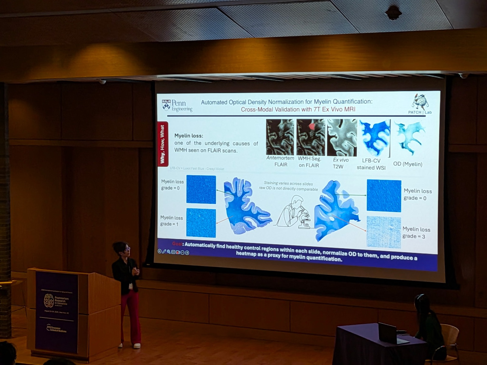
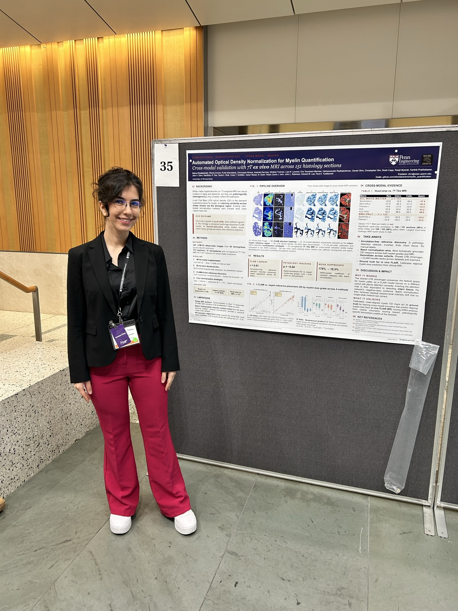
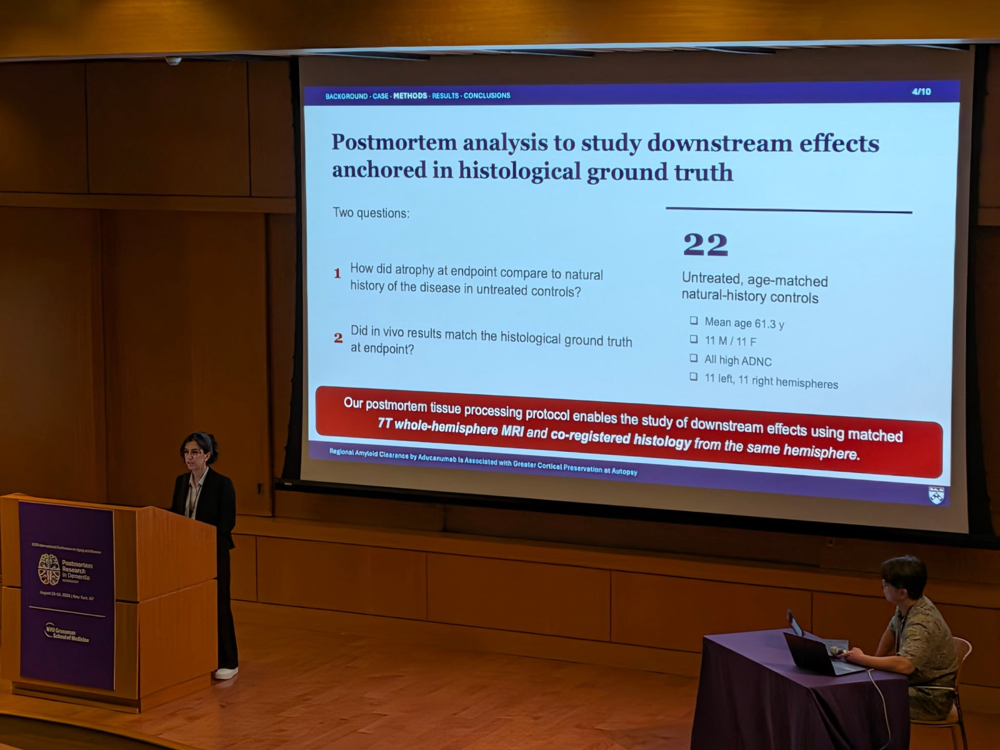

# Talks & Posters

### Postmortem Research in Dementia
> Aug 13–14, 2026 | NYU Grossman School of Medicine, New York, NY

Two presentations at the workshop:

**Automated Optical Density Normalization for Myelin Quantification: Cross-Modal Validation with 7T Ex Vivo MRI** — power pitch and poster (#35).

- Luxol Fast Blue optical density is the standard proxy for myelin, but staining varies from batch to batch, so raw values are not comparable across slides.
- We find intact-myelin reference regions inside each slide by inverting the attention of a pathology-detection model — the white matter it ignores is the most intact tissue — and calibrate optical density against them, with no manual annotation.
- Validated against expert-placed reference regions (r = 0.91), expert myelin-loss grading, and co-registered 7T ex vivo MRI across 151 histology sections. [Preprint](https://arxiv.org/abs/2605.08711)

**Regional Amyloid Clearance by Aducanumab Is Associated with Greater Cortical Preservation at Autopsy** — talk, presenting work led by Chinmayee Athalye.

- A single aducanumab-treated case with patchy amyloid clearance, allowing cleared and uncleared cortex to be compared within the same brain.
- The PET-defined clearance map was carried through in vivo MRI and 7T postmortem MRI onto co-registered histology, so an imaging-defined treatment effect could be read out directly on neuropathology.

  
  
  

### Upcoming

- **MICCAI 2026**, main conference — oral presentation, "Automated Optical Density Normalization for Myelin Quantification" (top 9% of 4,601 submissions). [Preprint](https://arxiv.org/abs/2605.08711)
- **SASHIMI 2026** (11th International Workshop on Simulation and Synthesis in Medical Imaging, in conjunction with MICCAI 2026) — "Does FLAIR super-resolution erase or hallucinate small white-matter lesions?" [Preprint](https://arxiv.org/abs/2608.06311)

### Earlier

- **AAIC 2025** — white matter hyperintensities assessed on matched in vivo and ex vivo brain MRI.
